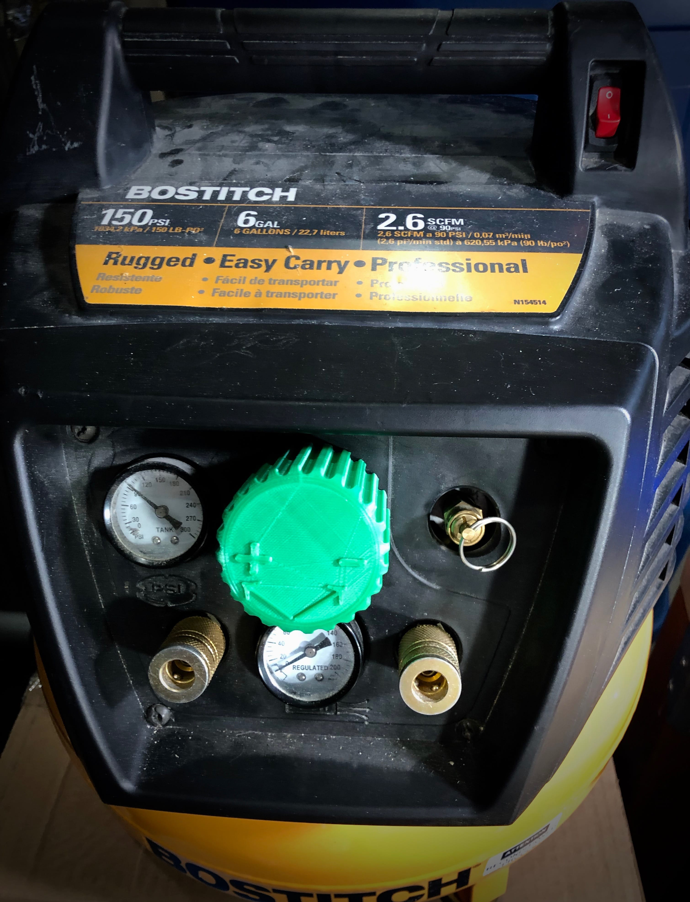

# Bostitch Air Compressor Knob Extender Cap
I used this Bostitch Air Compressor for house projects, but got frustrated by how hard the knob is to turn when adjusting pressure, especially towards higher psi. To make it easier to turn, I designed this knob extender which makes the knob thicker and gives you extra leverage when turning it.

I printed it on my Creality CR-10 using 0.2mm layer height and 20% infill.

